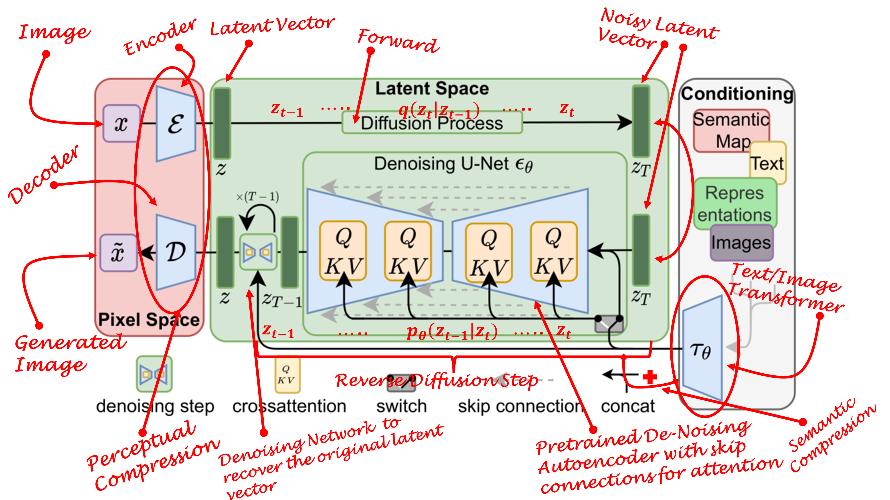
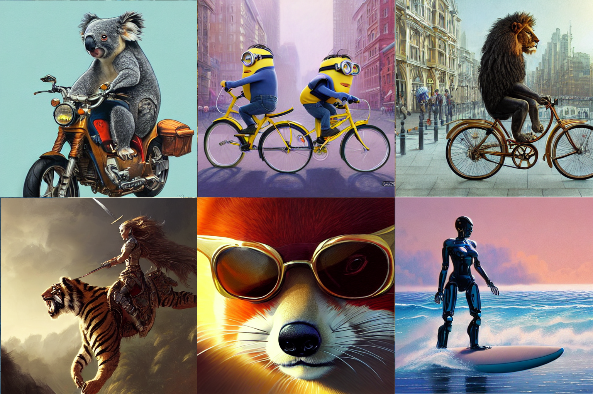

# Latent Diffusion Models Tutorial

## An Easy Guide to Latent Diffusion Models.

## Requirements

If you would like to run it on your own PC instead then make sure you have sufficient hardware resources. Setup a Conda environment with python 3.7 and pytorch.

## Running The Notebook

* Open the Notebook in Google Colab or local jupyter server
* Make sure GPU is selected in the runtime (Runtime->Change Type->GPU)
* Install the requirements
* Run the code in the example sections 
* In case of GPU out of memory error, make sure that the model from one example is cleared before running another example. Alternatively, you can restart the runtime and run that particular example directly instead of running the whole notebook.

## The tutorial 📃
The full tutorial is available on medium.

https://azad-wolf.medium.com/what-are-stable-diffusion-models-and-why-are-they-a-step-forward-for-image-generation-aa1182801d46

## Text to Image Synthesis

## References 

[1] Jonathan Ho, Ajay Jain, Pieter Abbeel, "Denoising Diffusion Probabilistic Models", 2020

[2] Alec Radford, Jong Wook Kim, Chris Hallacy, Aditya Ramesh, Gabriel Goh, Sandhini Agarwal, Girish Sastry, Amanda Askell, Pamela Mishkin, Jack Clark, Gretchen Krueger, Ilya Sutskever,"Learning Transferable Visual Models From Natural Language Supervision", 2021

[3] Robin Rombach and Andreas Blattmann and Dominik Lorenz and Patrick Esser and Björn Ommer, "High-Resolution Image Synthesis with Latent Diffusion Models", arXiv:2112.10752, 2021

[4] Blattmann, Andreas and Rombach, Robin and Oktay, Kaan and Ommer, Björn, "Retrieval-Augmented Diffusion Models", CVPR, 2022

[5] Blattmann et. al., Latent Diffusion Models, https://github.com/CompVis/latent-diffusion, 2022

[6] Blattmann et. al., Stable Diffusion, https://github.com/CompVis/stable-diffusion, 2022

